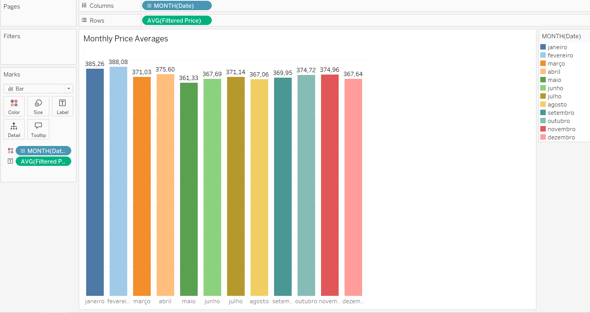

# Airbnb Listings Analysis: Rio de Janeiro (2022–2024)

This project focused on analyzing Airbnb listings in Rio de Janeiro, Brazil, using data from September 25, 2024. The goal was to provide actionable insights about accommodation prices, reservation patterns, and neighborhood trends while leveraging Tableau's functionalities to handle data challenges internally.

## Data Preparation

The following datasets and files were used for the analysis:

1. **Listings Dataset**: Contained key information such as Price, Room Type, Neighbourhood, and Host ID.
2. **Reviews Dataset**: Joined with the Listings dataset using `id` (listings) and `listing_id` (reviews).
3. **Neighborhoods Dataset**: Provided a list of neighborhoods and their characteristics, joined via the Neighbourhood field.
4. **Neighborhoods GeoJSON**: Used to delimit neighborhood boundaries for geospatial visualizations.


---

## Visualization Process and Challenges

Each visualization was designed to address specific questions or challenges in the dataset. Several techniques were employed to resolve distortions or improve insights.

### 1. Average Price by Accommodation Type

- **Chart Name**: "Average Price by Accommodation Type"
- **Description**: Calculated the average price (`AVG(Price)`) across four accommodation types: Entire Home/Apt, Hotel Room, Private Room, and Shared Room.
- **Challenge**: None. This was the simplest analysis, providing an overview of how prices differ by accommodation type.
- **Key Insight**: Entire homes and hotel rooms were priced significantly higher than private or shared rooms.


---

### 2. Monthly Reservations

- **Chart Name**: "Monthly Reservations (2022–2023)"
- **Description**: Focused on the number of reservations per month, excluding 2024 (due to incomplete data) and emphasizing post-COVID years (2022–2023).
- **Challenge**: Ensuring the data reflected complete years for accuracy.
- **Key Insight**: November was consistently the peak month, with a record of 45,948 reservations across both years.


---

### 3. Price Heatmap by Neighborhood

- **Chart Name**: "Price Heatmap by Neighborhood"
- **Description**: This heatmap used the GeoJSON file to visualize average prices across Rio’s neighborhoods. However, distortions arose due to:
  - Outliers inflating averages.
  - Small neighborhoods with few listings dominating the rankings.
- **Solutions**:
  - **Year Filter**: Limited the data to 2022–2024 for consistency.
  - **Price Capping**: Created a calculated field (`Filtered Price`) to cap prices at R$6,000:
    ```plaintext
    IF [Price] > 6000 THEN 6000 ELSE [Price] END
    ```
    This adjustment was performed in Tableau to reduce the influence of outliers without losing significant data.

  

- **Challenge**: Performing this adjustment within Tableau, as it is typically handled in Python during preprocessing.
- **Key Insight**: After filtering, traditional luxury neighborhoods like Ipanema and Leblon emerged as high-price areas, consistent with their market reputation.


---

### 4. Top 10 Most Expensive Neighborhoods

- **Chart Name**: "Top 10 Most Expensive Neighborhoods"
- **Description**: Displayed the top 10 neighborhoods based on the `Filtered Price`. To ensure representativeness:
  - A filter was applied to include only neighborhoods with at least 2,000 unique Host IDs.
- **Challenge**: Avoiding bias from small neighborhoods with insufficient data.
- **Key Insight**: Leblon and Ipanema led the rankings, with average filtered prices of R$551.6 and R$531.3, respectively.


---

### 5. Monthly Price Averages

- **Chart Name**: "Monthly Price Averages (2022–2024)"
- **Description**: Displayed the average monthly price using the `Filtered Price` field to address outliers.
- **Key Insight**: Prices were relatively stable throughout the year, with February slightly higher, likely due to Rio’s Carnival season.



---

## Dashboard Summary

The final dashboard integrated all these visualizations into a cohesive analysis, showcasing insights into pricing trends, reservation patterns, and neighborhood comparisons.


---

## Conclusion

This analysis demonstrates how to effectively handle data challenges such as outliers and incomplete information directly in Tableau. Key steps included:

- Applying calculated fields to cap extreme values (`Filtered Price`).
- Using filters to ensure representativeness (e.g., minimum host count).
- Leveraging geospatial data for heatmaps to highlight neighborhood trends.

### Key Insights:

1. **November consistently saw the highest reservation volume.**
2. **Leblon and Ipanema remained the most expensive neighborhoods.**
3. **Entire homes and hotel rooms commanded significantly higher prices compared to private or shared rooms.**

The project underscores the importance of addressing data quality issues within the visualization tool to produce accurate, actionable insights.
